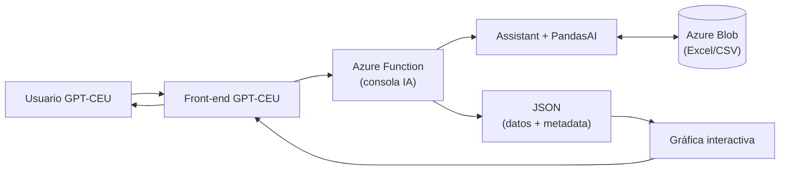

# gpt-ceu-console-tfg
# GPT-CEU Console – TFG Rubén García

Consola de IA integrada con GPT-CEU para gestionar y explotar datos académicos (Excel/CSV) con
respuestas estructuradas en JSON listas para visualización. Incluye templates (`matriculados`, `tasas`)
y consultas sin template.

## ✨ Objetivos
- Unificar acceso a fuentes de datos universitarios heterogéneas.
- Automatizar selección de archivos y preprocesado (filtros/desambiguación).
- Devolver JSON auditable para gráficas interactivas (hover/tooltips).
- Reducir latencia mediante reutilización/warm-up (medición pareada).

## 🗺️ Arquitectura (resumen)

## 📦 Estructura del repositorio
src/console/            # Código de la consola (Azure Function + helpers)
  ├─ __init__.py
  ├─ agente_openai.py
  ├─ crear_agenteopenai.py
  ├─ csvpandasai.py
  ├─ azuredatapandasai.py
  └─ prompt.txt
notebooks/
  └─ resultados.ipynb   # Notebook que genera las tablas/figuras del TFG
README.md
requirements.txt
.env.example
.gitignore
LICENSE

## 📁 Componentes del código

### `src/console/`
- **`__init__.py`** — **Punto de entrada** (Azure Function HTTP).
  - Recibe la petición, valida parámetros, decide si es **template** o **consulta libre**, llama a las utilidades de datos y construye la **respuesta JSON** final (incluyendo `metadata`).
  - Gestiona reintentos básicos y tiempos para registrar latencia.

- **`crear_agenteopenai.py`** — **Configuración del agente/cliente LLM**.
  - Carga claves desde variables de entorno (`OPENAI_API_KEY`) y crea el cliente (o Assistant) que usará la consola.
  - Centraliza el modelo que usa PandasAI/OpenAI (p.ej. `o3-mini`) para que sea fácil cambiarlo.

- **`agente_openai.py`** — **Capa de abstracción con OpenAI**.
  - Funciones helper para **enviar prompts**, postprocesar respuestas, y manejar errores comunes del proveedor.
  - Si usas Assistants/Threads, aquí va la lógica de creación/consulta y parsing.

- **`csvpandasai.py`** — **Lógica de datos (CSV/Excel) y PandasAI**.
  - Carga y limpia DataFrames, aplica **filtros/selección de columnas**, resuelve pequeñas ambigüedades.
  - Ejecuta consultas con **PandasAI**, valida los resultados y transforma al **JSON “contractual”** (datos + `metadata`: fuentes, filtros, unidades, timings, cache, etc.).

- **`azuredatapandasai.py`** — **Acceso a Azure Blob Storage**.
  - Descarga el **CSV de metadatos** (registro de ficheros del Cuadro de Mandos) usando `AZURE_CONNECTION_STRING`.
  - Devuelve DataFrames listos para que `csvpandasai.py` seleccione el fichero/hoja correcto.

- **`generacion_descripciones`** - **Descripciones CSV de metadatos**
-  Cuando se sube un excel a la carpeta de sharepoint, dispara un power automate que hace una llamada HTTP a esta función.
-   Recibe el archivo y el nombre de la carpeta y se le pasa a la API de OpenAI el archivo con code interpreter para que pueda leer el excel y se le pide que genere una descripcion del archivo excel y se guarda en el csv de metadatos. 
  
- **`prompt.txt`** — **Contrato y reglas del agente**.
  - Instrucciones del sistema: formato de **respuesta JSON**, plantillas disponibles (`matriculados`, `tasas`), títulos de gráficos, y convenciones para `metadata`.

### `notebooks/`
- **`resultados.ipynb`** — **Notebook de análisis** (capítulo de resultados del TFG).
  - Genera CSV y figuras (boxplots, histogramas, barras con error bars y paired plots).
  - Incluye **bootstrap pareado** de Δmedia, **Cohen’s d** y **speed-up** con intervalos.

---

## Ejemplo de interacción
Consulta del usuario: "Dime el total de matriculados en 2023-2024."

Respuesta:
{
  "id_respuesta": "1",
  "respuesta_usuario": [
    {
      "consulta": "Número total de matriculados en el curso 2023-2024",
      "tipo_grafico": "None",
      "template": "False",
      "archivos_relevantes": ["matriculas_2023_2024.csv"],
      "consulta_resumida": "Matriculados 2023-2024",
      "titulo_grafico": "Sin título",
      "grafico_conjunto": false,
      "respuesta": "19326.0",
      "respuesta_corta": "{\"matriculados\": 19326.0}"
    }
  ],
  "formato_respuesta": "json",
  "dominio": "Cuadro de mandos"
}

