# gpt-ceu-console-tfg
# GPT-CEU Console – TFG Rubén García

Consola de IA integrada con GPT-CEU para gestionar y explotar datos académicos (Excel/CSV) con
respuestas estructuradas en JSON listas para visualización. Incluye templates (`matriculados`, `tasas`)
y consultas sin template.

## ✨ Objetivos
- Unificar acceso a fuentes de datos universitarios heterogéneas.
- Automatizar selección de archivos y preprocesado (filtros/desambiguación).
- Devolver JSON auditable para gráficas interactivas (hover/tooltips).
- Reducir latencia mediante reutilización/warm-up (medición pareada).

## 🗺️ Arquitectura (resumen)

```mermaid
flowchart LR
  U["Usuario GPT-CEU"]
  FE["Front-end GPT-CEU"]
  AF["Azure Function<br/>(consola IA)"]
  OA["Assistant + PandasAI"]
  B[("Azure Blob<br/>(Excel/CSV)")]
  J["JSON<br/>(datos + metadata)"]
  G["Gráfica interactiva"]

  U --> FE
  FE --> AF
  AF --> OA
  OA <--> B
  AF --> J
  J --> G
  G --> FE
  FE --> U
```

## 📦 Estructura del repositorio
src/console/            # Código de la consola (Azure Function + helpers)
  ├─ __init__.py
  ├─ agente_openai.py
  ├─ crear_agenteopenai.py
  ├─ csvpandasai.py
  ├─ azuredatapandasai.py
  └─ prompt.txt
notebooks/
  └─ resultados.ipynb   # Notebook que genera las tablas/figuras del TFG
README.md
requirements.txt
.env.example
.gitignore
LICENSE

## 📁 Componentes del código

### `src/console/`
- **`__init__.py`** — **Punto de entrada** (Azure Function HTTP).
  - Recibe la petición, valida parámetros, decide si es **template** o **consulta libre**, llama a las utilidades de datos y construye la **respuesta JSON** final (incluyendo `metadata`).
  - Gestiona reintentos básicos y tiempos para registrar latencia.

- **`crear_agenteopenai.py`** — **Configuración del agente/cliente LLM**.
  - Carga claves desde variables de entorno (`OPENAI_API_KEY`) y crea el cliente (o Assistant) que usará la consola.
  - Centraliza el modelo que usa PandasAI/OpenAI (p.ej. `o3-mini`) para que sea fácil cambiarlo.

- **`agente_openai.py`** — **Capa de abstracción con OpenAI**.
  - Funciones helper para **enviar prompts**, postprocesar respuestas, y manejar errores comunes del proveedor.
  - Si usas Assistants/Threads, aquí va la lógica de creación/consulta y parsing.

- **`csvpandasai.py`** — **Lógica de datos (CSV/Excel) y PandasAI**.
  - Carga y limpia DataFrames, aplica **filtros/selección de columnas**, resuelve pequeñas ambigüedades.
  - Ejecuta consultas con **PandasAI**, valida los resultados y transforma al **JSON “contractual”** (datos + `metadata`: fuentes, filtros, unidades, timings, cache, etc.).

- **`azuredatapandasai.py`** — **Acceso a Azure Blob Storage**.
  - Descarga el **CSV de metadatos** (registro de ficheros del Cuadro de Mandos) usando `AZURE_CONNECTION_STRING`.
  - Devuelve DataFrames listos para que `csvpandasai.py` seleccione el fichero/hoja correcto.

- **`prompt.txt`** — **Contrato y reglas del agente**.
  - Instrucciones del sistema: formato de **respuesta JSON**, plantillas disponibles (`matriculados`, `tasas`), títulos de gráficos, y convenciones para `metadata`.

### `notebooks/`
- **`resultados.ipynb`** — **Notebook de análisis** (capítulo de resultados del TFG).
  - Genera CSV y figuras (boxplots, histogramas, barras con error bars y paired plots).
  - Incluye **bootstrap pareado** de Δmedia, **Cohen’s d** y **speed-up** con intervalos.

---

